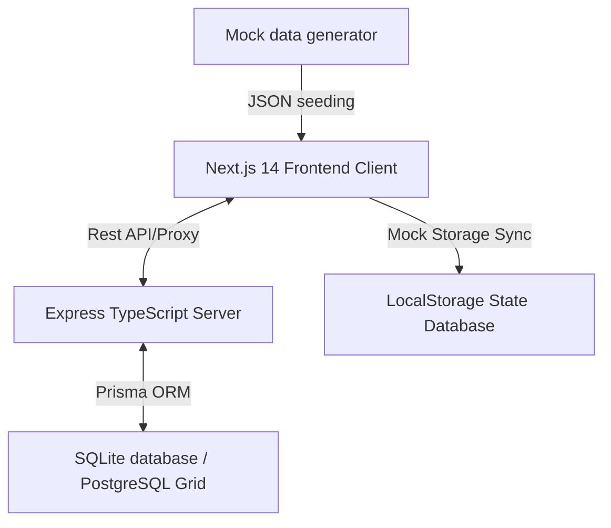
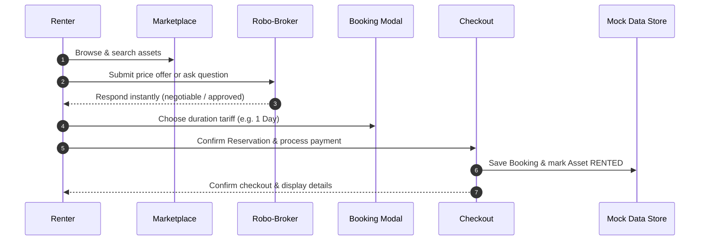

# 🤖 AssetAgent.AI 🚀

> **India's First AI-Powered Marketplace for Idle Physical Assets** 🇮🇳
> Lease or rent parking spaces, empty rooms, offices, tools, vehicles, and equipment instantly with automated AI negotiation and premium spatial matching.

---

<p align="center">
  
  
  
  
  
  
</p>

---

## 📖 Table of Contents
- [🌟 Hero Banner](#-hero-banner)
- [✨ Key Features](#-key-features)
- [🧩 AI Features & Smart Brokerage](#-ai-features--smart-brokerage)
- [🗣️ Voice Listing Assistant](#️-voice-listing-assistant)
- [🖥️ Screenshots & UI walkthrough](#-screenshots--ui-walkthrough)
- [📐 Architecture Overview](#-architecture-overview)
- [🛠️ Tech Stack](#️-tech-stack)
- [📂 Folder Structure](#-folder-structure)
- [⚙️ Environment Variables](#️-environment-variables)
- [👥 Demo Accounts](#-demo-accounts)
- [🔄 Project Workflow](#-project-workflow)
- [💻 Run Locally](#-run-locally)
- [🐳 Docker Deployment](#-docker-deployment)
- [🔮 Future Scope](#-future-scope)
- [🤝 Contributors](#-contributors)
- [📄 License](#-license)

---

## 🌟 Hero Banner

```
 █████  ███████ ███████ ███████ ████████  █████   ██████  ███████ ███    ██ ████████      █████  ██ 
██   ██ ██      ██      ██         ██    ██   ██ ██       ██      ████   ██    ██        ██   ██ ██ 
███████ ███████ ███████ █████      ██    ███████ ██   ███ █████   ██ ██  ██    ██        ███████ ██ 
██   ██      ██      ██ ██         ██    ██   ██ ██    ██ ██      ██  ██ ██    ██        ██   ██ ██ 
██   ██ ███████ ███████ ███████    ██    ██   ██  ██████  ███████ ██   ████    ██        ██   ██ ██ 
                                                                                                    
```
*Empowering individuals and enterprises across India to monetize idle capital, spaces, and equipment through autonomous negotiation protocols and immediate digital spatial leasing.*

---

## ✨ Key Features

| Category | Description | Emojis |
| :--- | :--- | :---: |
| **Instant Matching** | Renters can instantly find high-fidelity verified listings across 15+ Indian cities. | 📍🇮🇳 |
| **Surge Tariff Engine** | Owners can simulate dynamic pricing adjustments based on demand factor surge models. | 📈⚡ |
| **Detailed Booking Hub** | A full checkout modal showing detailed pricing, base rent, deposits, and platform/cleaning fees. | 📋💳 |
| **Local Mock Database** | Out-of-the-box local storage synchronization to test operations seamlessly. | 💾🔒 |
| **Pure Aesthetics** | A vibrant dark/light glassmorphic UI matching state-of-the-art SaaS designs. | 🎨💎 |

* **🇮🇳 Indian Cities Localization:** Real geographic coordinates, area sizes in `sq ft`, and PIN codes spanning Delhi, Bangalore, Chennai, Mumbai, Coimbatore, Mysore, Kochi, Hyderabad, and more.
* **📂 Complete Monorepo Design:** Structured directories separating client UI elements, backend repositories, and schema migrations.

---

## 🧩 AI Features & Smart Brokerage

### 🤖 Local Robo-Broker Chat
AssetAgent AI implements a simplified, responsive client-side Robo-Broker to act as an automated negotiator for rental terms. The broker operates fully in the browser to avoid unnecessary backend latency and helps secure optimal custom spatial leases.

#### 💬 Predefined Smart Response Matrix:
* **"Hello."** -> Greets the renter and outlines basic terms.
* **"Price is negotiable."** -> Answers budget inquiries and checks dynamic threshold conditions.
* **"Owner approved your request."** -> Finalizes the handshake once agreement parameters are satisfied.
* **"Security deposit required."** -> Explains safety deposits and terms of refund.
* **"Booking available."** -> Prompts renter to select start times and close the contract.

---

## 🗣️ Voice Listing Assistant

Owners can easily list their physical assets simply by speaking. The application has integrated browser-level web speech synthesis and recognition. 
* **Auto-parsing:** Captures title, category, description, and price directly from voice inputs.
* **Instant Listing:** Minimizes manual form filling to save time for busy listing owners.

---

## 🔐 Fake Authentication

The system uses a fast developer authentication wrapper to let developers preview both Owner and Renter portals without typing verification keys.
* 👨‍💼 **Owner Suite Dashboard:** Review rental logs, manage listing status (Active/Paused), check statistics, and run dynamic surge-pricing calculations.
* 🧑‍💻 **Renter Marketplace:** Scroll through 13 categories of items, search dynamically, add items to wishlists, negotiate using AI chat, and calculate booking durations.

---

## 🖥️ Screenshots & UI Walkthrough

#### 1. Renter Marketplace
A gorgeous grid showcasing available physical nodes categorized into rooms, parking, apartments, cameras, tools, and vehicles.
* Vibrant HSL color badges.
* Real-time distance indicators in kilometers.
* Quick actions for bookmarking and detail reviews.

#### 2. Large Interactive Booking Modal
A modern multi-column pop-up displaying:
* High-quality Unsplash image slides.
* Real-time pricing calculator for 1h, 3h, 6h, 12h, 1d, 3d, and 1w intervals.
* Complete breakdown of fees (platform charges, security deposit, cleaning charges).
* Auto-generated rental rules (Valid ID, CCTV monitoring, check-in/out times).
* Integrated local Robo-Broker chat widget.

---

## 📐 Architecture Overview



---

## 🛠️ Tech Stack

### Frontend Tier
* **Framework:** Next.js 14.2.15 (App Router with Suspense boundary wrappers)
* **Styling:** Tailwind CSS (Vibrant modern layouts, customized glassmorphism)
* **Animation:** Framer Motion (Smooth dialog spring transitions)
* **Icons:** Lucide React

### Backend Tier
* **Server Runtime:** Node.js + Express
* **Compiler:** TypeScript (TypeScript Config build target `ES6`)
* **ORM:** Prisma Client (SQLite database adapter)
* **Hot Reloading:** `ts-node-dev`

---

## 📂 Folder Structure

```
idel-assert-engine/
├── backend/
│   ├── src/
│   │   ├── ai/                 # AI Surge, Recommender, and Agreement generators
│   │   ├── config/             # DB configurations & environments
│   │   ├── controllers/        # Express route logic controllers
│   │   ├── repositories/       # Prisma database layer abstractions
│   │   ├── routes/             # API routes
│   │   └── server.ts           # App entryway
│   ├── package.json
│   └── tsconfig.json
├── database/
│   ├── dev.db                  # Local SQLite database
│   ├── schema.prisma           # Prisma schemas definitions
│   └── seed.ts                 # Dev user seeding scripts
├── docker/
│   ├── Dockerfile.backend      # Backend docker configuration
│   └── Dockerfile.frontend     # Frontend docker configuration
├── frontend/
│   ├── scripts/
│   │   └── generateMockData.mjs # Mock generator script
│   ├── src/
│   │   ├── app/                # Next.js App routes (renter, owner, profile)
│   │   ├── components/         # Reusable UI elements (Navbar, Footer, Badge)
│   │   ├── data/               # Seeded JSON assets, bookings, reviews
│   │   ├── hooks/              # Session hooks (useAuth)
│   │   └── utils/              # Client mock helpers
│   ├── package.json
│   └── tailwind.config.ts
├── docker-compose.yml
├── README.md
└── netlify.toml
```

---

## ⚙️ Environment Variables

Create a `.env` file in the **`/backend`** and root folders to configure settings:

```env
# Database configuration (Local SQLite out of the box)
DATABASE_URL="file:../../database/dev.db"

# Server Port
PORT=5000

# JSON Web Token Secret Keys
JWT_SECRET="development-secret-keys-grid-token"

# Optional OpenAI API Key (Falls back to local offline rules)
OPENAI_API_KEY=""
```

---

## 👥 Demo Accounts

Use these pre-registered login credentials to bypass form setup:

### 👨‍💼 Property Owner Suite
* **Email:** `owner@assetagent.ai`
* **Password:** `owner123`
* **Features:** Upload new spaces, configure base tariffs, view bookings ledger, trigger surge price simulation, and inspect statistics.

### 🧑‍💻 Renter Marketplace
* **Email:** `renter@assetagent.ai`
* **Password:** `renter123`
* **Features:** Rent spaces or items, chat with automated AI agents, select pricing tariffs, configure booking hours, and review historical logs.

---

## 🔄 Project Workflow



---

## 💻 Run Locally

### Prerequisites
* Node.js v18 or later
* npm (Node Package Manager)

### Step 1: Install Dependencies
Install dependencies in both directories:

```bash
# Install backend dependencies
cd backend
npm install

# Install frontend dependencies
cd ../frontend
npm install
```

### Step 2: Set Up the Database
Sync your Prisma schemas and seed the demo users:

```bash
cd ../backend
npm run db:generate
npm run db:push
```

To clear and seed the database, run:
```bash
npm run db:seed
```

### Step 3: Run the Services
Start the Express API server and the Next.js dev server:

```bash
# Start the Backend Server (Runs on port 5000)
cd backend
npm run dev
```

In a new terminal window:
```bash
# Start the Frontend App (Runs on port 3000)
cd frontend
npm run dev
```

Navigate to **`http://localhost:3000`** in your browser to view the app! 🚀

---

## 🐳 Docker Deployment

You can launch the entire project including the Express backend, Prisma client, and Next.js frontend containerized using Docker Compose:

```bash
# Build and run containers
docker-compose up --build
```

Access details:
* **Frontend client:** http://localhost:3000
* **Backend API server:** http://localhost:5000/api

---

## 🔮 Future Scope

- [ ] **Smart Lock Provisioning Integration:** Connect physical hardware unlock codes to third-party smart device APIs.
- [ ] **Real Voice-to-Text NLP parsing:** Use custom NLP models instead of browser WebSpeech to analyze listing details.
- [ ] **Secure Cryptographic Leases:** Save dynamic spatial rental agreements onto decentralized ledgers.
- [ ] **Interactive Geo-mapping:** Display live asset pins on maps using Mapbox or OpenStreetMap widgets.
- [ ] **Real UPI/Card Payment Gateways:** Integrate Stripe, Razorpay, or Paytm APIs.

---

## 🤝 Contributors

* **Nithiya Sri Ramasamy** ([@Nithiyasriramasamy](https://github.com/Nithiyasriramasamy)) - Project architect and developer.

---

## 📄 License

Distributed under the MIT License. See `LICENSE` for more information.

---

*Developed with ❤️ in India for the next-generation autonomous sharing economy.*
